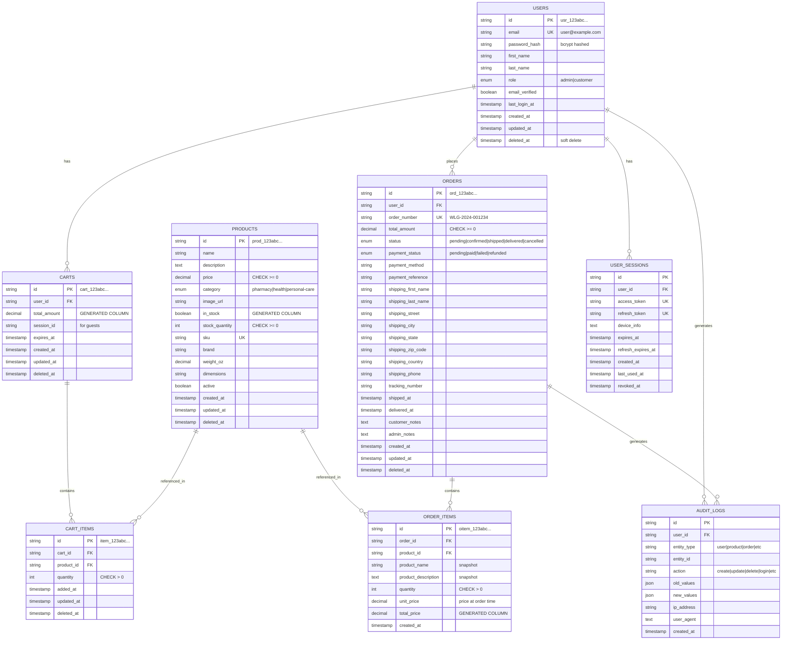
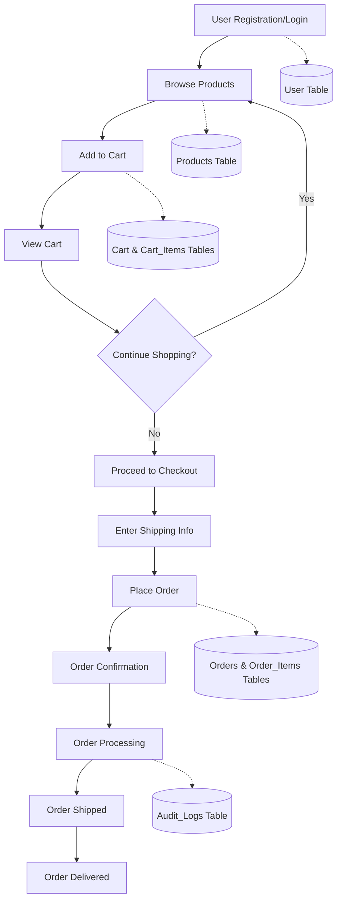
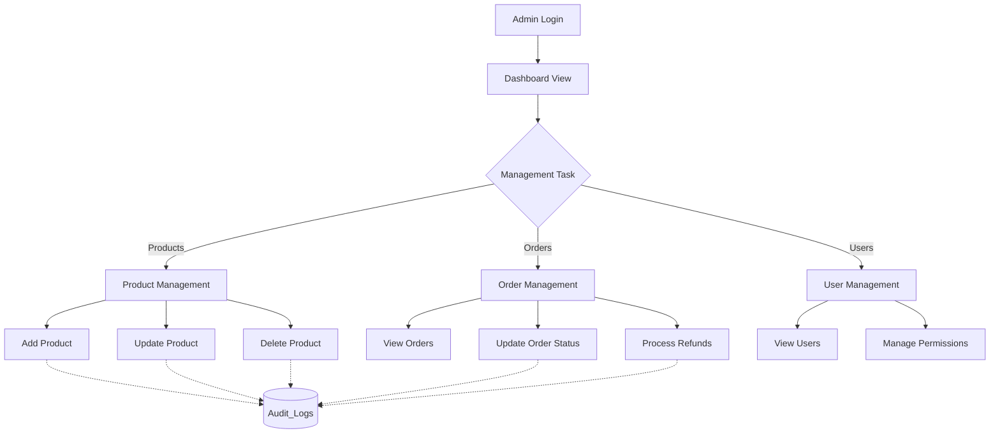
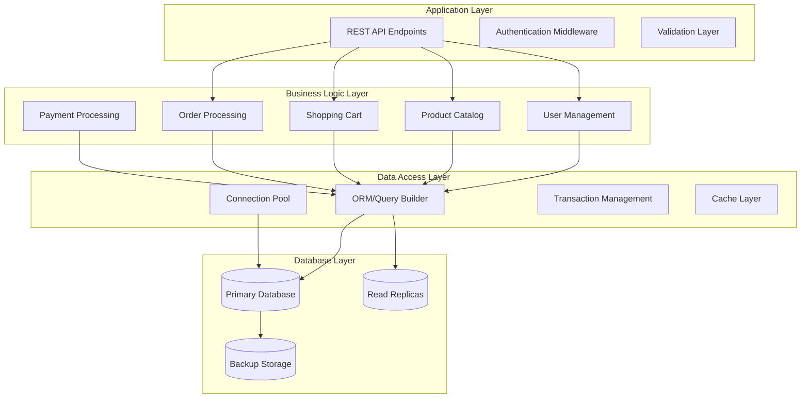
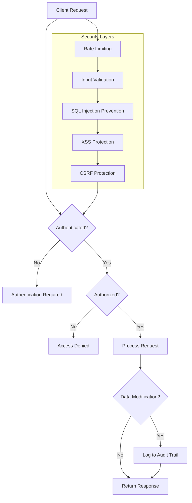
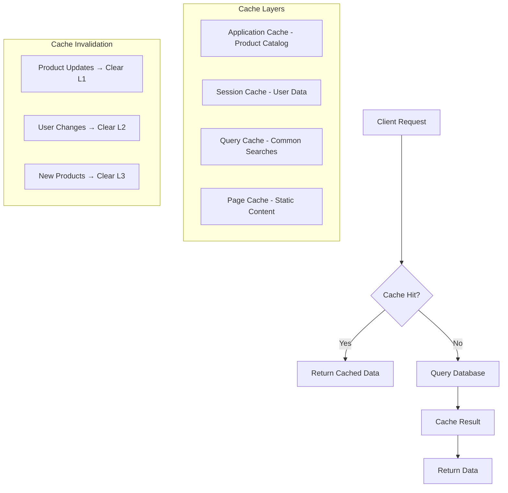

# Entity Relationship Diagram

This document provides visual representations of the database relationships and data flow for the Walgreens POC application.

## Database Entity Relationships



## Data Flow Diagrams

### User Shopping Flow



### Admin Management Flow



## Database Architecture Layers



## Security Model



## Performance Optimization

### Indexing Strategy

```mermaid
graph LR
    subgraph "Primary Indexes"
        P1[users.email]
        P2[products.category]
        P3[orders.user_id]
        P4[cart_items.cart_id]
    end
    
    subgraph "Composite Indexes"
        C1[products(category, in_stock, price)]
        C2[orders(user_id, status, created_at)]
        C3[cart_items(cart_id, product_id)]
    end
    
    subgraph "Full-Text Indexes"
        F1[products(name, description)]
    end
    
    subgraph "Query Types"
        Q1[Product Search] --> F1
        Q2[User Orders] --> C2
        Q3[Cart Operations] --> C3
        Q4[Category Browse] --> C1
    end
```

### Caching Strategy



This comprehensive documentation provides all the visual representations and architectural guidance needed for implementing a robust backend infrastructure that aligns with the existing frontend TypeScript models and API contracts.